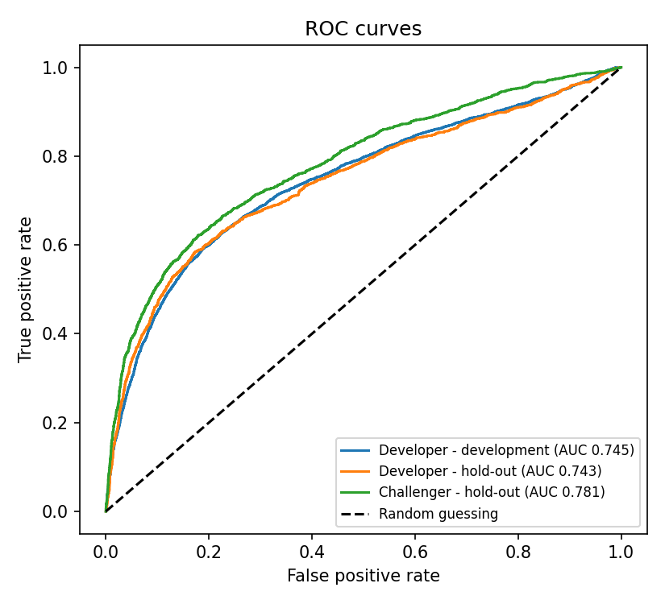

# Credit-Risk PD Model: Build and Independent Validation

A two-step Python project that builds a **Probability-of-Default (PD) model** for credit-card customers and then **validates it the way a bank's model-risk team would**: replicating it, testing how well it ranks and predicts, benchmarking it against alternatives, stress-testing it, and writing up findings.

**Tools:** Python · pandas · NumPy · statsmodels · scikit-learn · SciPy · Matplotlib

## The idea in plain words

Banks use models to decide who gets credit and how much money to set aside for losses. A wrong model costs money, so someone *other than the builder* must check it. That checking is called **model validation**. This project does both jobs:

1. **Developer** (`01_develop_pd_model.py`): builds a logistic regression that gives each customer a probability of missing next month's payment.
2. **Validator** (`02_validate_pd_model.py`): receives only the data, the model documentation and the predictions, and independently checks the work.

The validator's written conclusions are in [`validation_report.md`](validation_report.md).

## Headline results (hold-out sample of 7,200 customers)

| Check | Result |
|---|---|
| Replication | Model reproduced exactly from documentation (differences ~10⁻⁷) |
| Ranking power | AUC 0.743, Gini 0.486, KS 0.412; no sign of overfitting (AUC gap 0.002) |
| Average accuracy | Predicted PD 22.0% vs actual default rate 22.1% |
| Detailed accuracy | 4 of 10 risk deciles mis-calibrated |
| Challenger model | Gradient boosting scores higher (Gini 0.561), so the simple model leaves accuracy unused |
| Stress behaviour | A wrong-signed input makes PD *fall* when payments fall |

**7 findings** were raised (1 High, 3 Medium, 3 Low). Conclusion: acceptable for ranking customers, not yet fit for stress testing.



## What the validator tests

| Test | Question it answers |
|---|---|
| Data quality | Is the data clean and are the codes documented? |
| Replication | Can the model be rebuilt from its documentation, with different software, and give the same answers? |
| Conceptual soundness | Do the coefficients make business sense? Are inputs too similar to each other (VIF)? |
| Discrimination | Does it place risky customers above safe ones? (AUC, Gini, KS, development vs hold-out) |
| Calibration | Are the predicted probabilities close to what really happened? (decile table, binomial test, Brier score) |
| Stability | Does the data the model sees stay similar over samples? (PSI) |
| Benchmarking | Does it beat naive and simple alternatives, and how far ahead is a more complex challenger? |
| Sensitivity | What happens to predicted PDs if balances, payments, repayment behaviour or limits worsen? |

## How to run

```bash
pip install -r requirements.txt
python 01_develop_pd_model.py      # builds the model, writes outputs/
python 02_validate_pd_model.py     # validates it, writes outputs/validation/
```

## Folder guide

| Path | Contents |
|---|---|
| `data/credit.csv` | 24,000-account copy of the UCI "Default of Credit Card Clients" dataset |
| `01_develop_pd_model.py` | Developer step |
| `02_validate_pd_model.py` | Validator step |
| `validation_report.md` | The validation report and findings log |
| `outputs/` | Model documentation, predictions, and (in `outputs/validation/`) every test table and chart |

## Short glossary

- **PD (probability of default):** the estimated chance a customer misses a payment.
- **Development vs hold-out sample:** the model learns from the first; the second is kept hidden to test it.
- **AUC / Gini / KS:** scores for how well the model ranks risky customers above safe ones (0.5 AUC = coin flip; Gini = 2 × AUC − 1).
- **Calibration:** whether predicted probabilities match reality (customers given 20% should default about 20% of the time).
- **PSI (Population Stability Index):** how much the mix of customers has changed; below 0.10 is stable.
- **Challenger model:** a different model used as a yardstick for the main one.
- **Sensitivity analysis:** re-scoring customers after a what-if change, e.g. payments 20% lower.

## Limitations

- Developer and validator roles were both played by one person, so this shows the method, not real independence.
- The data has no dates, so no out-of-time back-test is possible. It is a 2005 Taiwan card-portfolio snapshot with a 1-month default definition; it is not a US portfolio, and LGD/EAD models are not covered.
- Scenario shocks are simple what-ifs, not regulatory (CCAR-style) scenarios.

## Data source

Yeh, I. C., & Lien, C. H. (2009). *The comparisons of data mining techniques for the predictive accuracy of probability of default of credit card clients.* Expert Systems with Applications, 36(2), 2473–2480. UCI Machine Learning Repository, licensed CC BY 4.0. The CSV used here is a 24,000-row copy distributed in the PyCaret repository.
